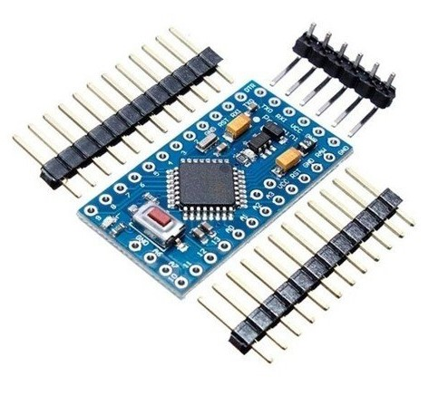

Hardware Requirements
=====================

The following **hardware requirements** are necessary to use Benchmark Arduino Pro Mini:

   - Arduino Pro Mini;

Arduino Pro Mini
----------------

The Arduino Pro Mini is a microcontroller board based on the ATmega328. It has 14 digital input/output pins (of which 6 can be used 
as PWM outputs), 6 analog inputs, an on-board resonator, a reset button, and holes for mounting pin headers. A six pin header can be 
connected to an FTDI cable or Sparkfun breakout board to provide USB power and communication to the board. The Arduino Pro Mini is 
intended for semi-permanent installation in objects or exhibitions. The board comes without pre-mounted headers, allowing the use of 
various types of connectors or direct soldering of wires. The pin layout is compatible with the Arduino Mini. There are two version 
of the Pro Mini. One runs at 3.3V and 8 MHz, the other at 5V and 16 MHz. The Arduino Pro Mini was designed and is manufactured by 
SparkFun Electronics.
 
Key features are listed below, hardware details can be found into `datasheet <_static/atmega328p.pdf>`_]:

   - Supply voltage (recommended): 5V ~ 12V (5V model) / 3.35V ~ 12V (3.3V model); 
   - Operating voltage: 5V / 3.3V (depending on model);
   - Microcontroller: ATmega328P (CMOS 8-bit microcontroller based on the AVR® enhanced RISC architecture);
   - Digital I/O pins: 14 (of which 6 provide PWM output);
   - Analog input pins: 6;
   - DC Current per I/O Pin: 40 mA; 
   - Flash memory: 32Kb (2Kb used by bootloader);
   - SRAM: 2Kb;
   - EEPROM: 1Kb;
   - CPU clock: 16MHz (5V model) / 8MHz (3.3V model);
   - UART: 1
   - SPI: 1
   - I2C: 1

.. image:: _static/pro-mini_pinout.jpg
   :align: center
   :alt: Arduino Pro Mini Pinout

.. toctree::
   :name: hw_req
   :maxdepth: 2
   :caption: Hardware Requirements